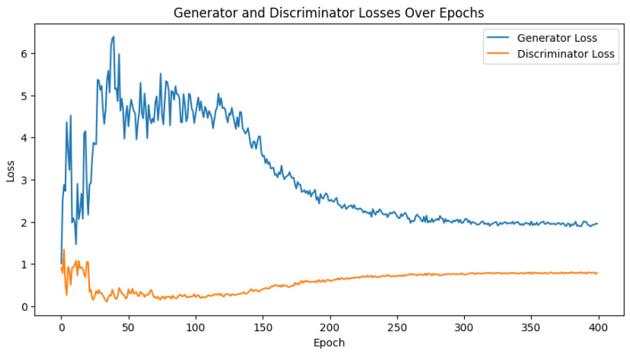
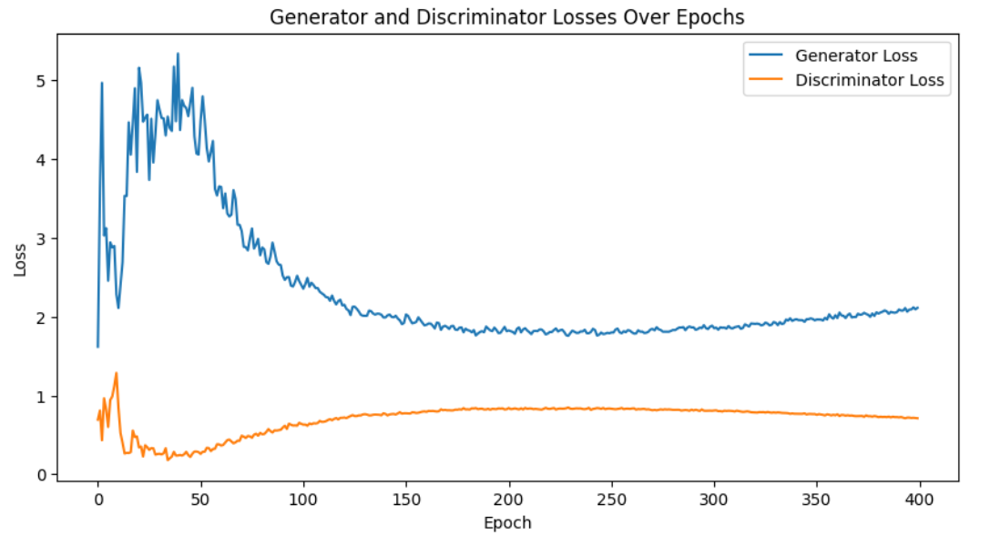


# DataLabAssignement2

## generate.py
Use the file *generate.py* to generate 10000 samples of MNIST in the folder samples. 
Example:
  > python3 generate.py --bacth_size 64

## requirements.txt
Among the good pratice of datascience, we encourage you to use conda or virtualenv to create python environment. 
To test your code on our platform, you are required to update the *requirements.txt*, with the different librairies you might use. 
When your code will be test, we will execute: 
  > pip install -r requirements.txt

## Checkpoints
Push the minimal amount of models in the folder *checkpoints*.
[initG.pth](checkpoints/initG.pth) – initial github version

## Test 1
[G1.pth V1](checkpoints/G.pth) - 400 epochs, lr 0.0001, bs 512

## Test 2
[G.pth V1](checkpoints/G.pth) - 400 epochs, lr 0.0001, bs 256

